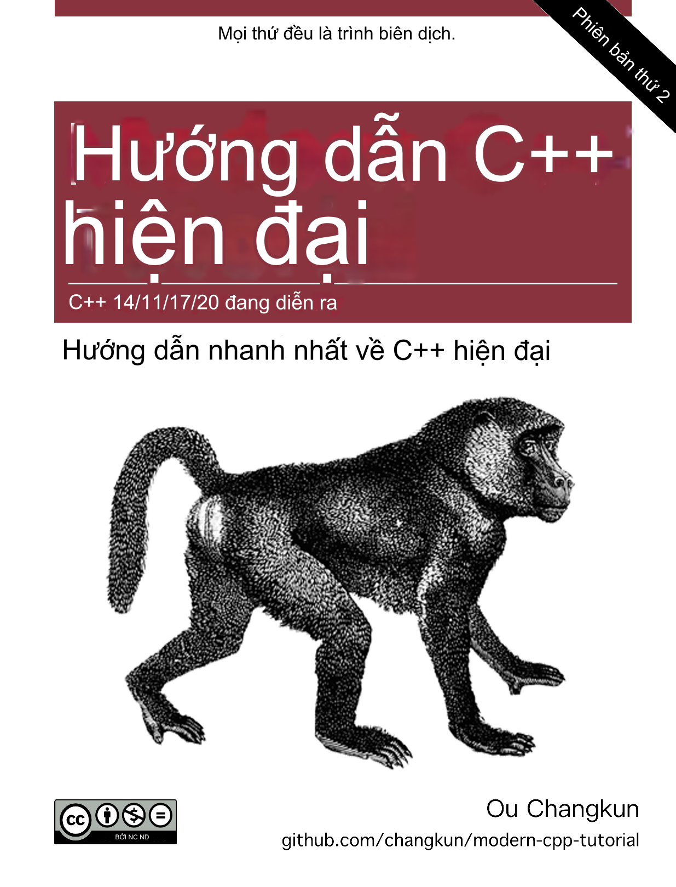

# Hướng dẫn C++ Hiện đại: C++11/14/17/20 Ngay lập tức

 [](./README.md) [](./README-zh-cn.md) [](./assets/donate.md)

## Mục đích

Cuốn sách tự nhận mình là "Ngay lập tức". Mục đích của nó là cung cấp một giới thiệu toàn diện về các tính năng liên quan đến C++ hiện đại (trước thập kỷ 2020).
Độc giả có thể chọn nội dung thú vị theo bảng nội dung sau để học và nhanh chóng làm quen với các tính năng mới mà bạn muốn học.
Độc giả nên biết rằng không phải tất cả các tính năng này đều được yêu cầu. Thay vào đó, nó nên được học khi bạn thực sự cần nó.

Đồng thời, thay vì chỉ lập trình, cuốn sách giới thiệu lịch sử phát triển của các yêu cầu kỹ thuật của nó (đơn giản nhất có thể), điều này giúp ích rất lớn trong việc hiểu tại sao những tính năng này ra đời.

Ngoài ra, tác giả muốn khuyến khích độc giả sử dụng trực tiếp C++ hiện đại trong các dự án mới của họ và chuyển dần các dự án cũ của họ sang C++ hiện đại sau khi đọc cuốn sách.

## Mục tiêu

- Cuốn sách này giả định rằng độc giả đã quen thuộc với C++ truyền thống (tức là C++98 hoặc sớm hơn), hoặc ít nhất là họ không gặp bất kỳ khó khăn nào trong việc đọc mã C++ truyền thống. Nói cách khác, những người có kinh nghiệm lâu dài trong C++ truyền thống và những người mong muốn nhanh chóng hiểu các tính năng của C++ hiện đại trong một thời gian ngắn thích hợp để đọc cuốn sách này.

- Cuốn sách này giới thiệu, đến một mức độ nhất định, ma thuật đen của C++ hiện đại. Tuy nhiên, những trò ma thuật này rất hạn chế, chúng không phù hợp với độc giả muốn học C++ nâng cao. Mục đích của cuốn sách này là cung cấp một khởi đầu nhanh chóng cho C++ hiện đại. Tất nhiên, độc giả nâng cao cũng có thể sử dụng cuốn sách này để ôn tập và tự kiểm tra về C++ hiện đại.

## Bắt đầu

Bạn có thể chọn từ các phương pháp đọc sau:

- [GitHub Online](./book/vi-vn/toc.md) 
- [Tài liệu PDF](https://changkun.de/modern-cpp/pdf/modern-cpp-tutorial-vi-vn.pdf)
- [Tài liệu EPUB](https://changkun.de/modern-cpp/epub/modern-cpp-tutorial-vi-vn.epub) 
- [Website](https://changkun.de/modern-cpp)

## Mã

Mỗi chương của cuốn sách này chứa rất nhiều mã. Nếu bạn gặp vấn đề khi viết mã của riêng mình với các tính năng giới thiệu của cuốn sách, việc đọc mã nguồn đi kèm với cuốn sách có thể giúp đỡ. Bạn có thể tìm cuốn sách [ở đây](./code). Tất cả mã được tổ chức theo chương, tên thư mục là số chương.

## Bài tập

Cuối mỗi chương của cuốn sách có một số bài tập. Những bài tập này nhằm kiểm tra xem bạn đã nắm vững kiến thức trong chương hiện tại hay chưa. Bạn có thể tìm câu trả lời có thể cho vấn đề [ở đây](./exercises). Một lần nữa, tên thư mục là số chương.

## Website

Mã nguồn của [website](https://changkun.de/modern-cpp) của cuốn sách này có thể tìm thấy [ở đây](./website), được xây dựng bởi [hexo](https://hexo.io) và [vuejs](https://vuejs.org). Website cung cấp cho bạn một cách khác để đọc cuốn sách, nó cũng thích ứng với trình duyệt di động.

## Xây dựng

Nếu bạn quan tâm đến việc xây dựng mọi thứ tại chỗ, nên sử dụng [Docker](https://docs.docker.com/install/). Để xây dựng, chỉ cần chạy:

```bash
$ make build
```

## Lời cảm ơn

Cuốn sách này ban đầu được viết bằng tiếng Trung bởi [Changkun Ou](https://changkun.de).

Tác giả có thời gian và kỹ năng ngôn ngữ hạn chế. Nếu độc giả tìm thấy bất kỳ lỗi nào trong cuốn sách hoặc bất kỳ cải tiến ngôn ngữ nào, xin vui lòng mở một [Issue](https://github.com/changkun/modern-cpp-tutorial/issues) hoặc bắt đầu một [Pull request](https://github.com/changkun/modern-cpp-tutorial/pulls). Đối với hướng dẫn chi tiết và checklist, vui lòng tham khảo [Cách đóng góp.](CONTRIBUTING.md).

Tác giả biết ơn tất cả những người đóng góp, bao gồm nhưng không giới hạn ở [Những người đóng góp.](https://github.com/changkun/modern-cpp-tutorial/graphs/contributors).

<p>This project is also supported by:</p>
<p>
  <a href="https://www.digitalocean.com/?refcode=834a3bbc951b&utm_campaign=Referral_Invite&utm_medium=Referral_Program&utm_source=CopyPaste">
    
  </a>
</p>

## Giấy phép

<a rel="license" href="https://creativecommons.org/licenses/by-nc-nd/4.0/"></a><br />Công trình này được viết bởi [Ou Changkun](https://changkun.de) và được cấp phép theo Giấy phép Quốc tế Creative Commons Attribution-NonCommercial-NoDerivatives 4.0. Mã của kho lưu trữ này được mở nguồn dưới [MIT license](./LICENSE).
