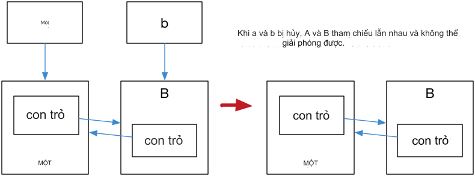

# Chương 05: Con trỏ thông minh và Quản lý bộ nhớ

[TOC]

## 5.1 RAII và Đếm tham chiếu

Lập trình viên quen thuộc với `Objective-C`/`Swift`/`JavaScript` hẳn đã biết khái niệm đếm tham chiếu.
Đếm tham chiếu được sử dụng để ngăn chặn rò rỉ bộ nhớ. Ý tưởng cơ bản là đếm số lượng con trỏ
trỏ đến một đối tượng được cấp phát động. Mỗi khi có thêm một con trỏ trỏ đến đối tượng,
bộ đếm tham chiếu của đối tượng đó sẽ tăng lên 1. Mỗi khi một con trỏ bị hủy,
bộ đếm tham chiếu giảm đi 1. Khi bộ đếm tham chiếu của một đối tượng về 0,
bộ nhớ heap mà đối tượng đó chiếm giữ sẽ được tự động giải phóng.

Trong C++ truyền thống, việc "nhớ" để giải phóng tài nguyên thủ công không phải lúc nào cũng là
cách tốt nhất, bởi vì chúng ta có thể quên giải phóng tài nguyên, dẫn đến rò rỉ bộ nhớ.
Thực hành phổ biến là cấp phát bộ nhớ cho đối tượng trong hàm tạo và giải phóng bộ nhớ
trong hàm hủy (được gọi khi đối tượng ra khỏi phạm vi).
Kỹ thuật này thường được gọi là RAII (Resource Acquisition Is Initialization -
thu nhận tài nguyên là khởi tạo).

Tuy nhiên, có những ngoại lệ, đôi khi chúng ta cần cấp phát đối tượng trên vùng nhớ heap.
Trong C++ truyền thống, chúng ta sử dụng `new` và `delete` để cấp phát và giải phóng bộ nhớ,
và phải "nhớ" để giải phóng bộ nhớ sau khi sử dụng xong.
C++11 giới thiệu khái niệm con trỏ thông minh, sử dụng ý tưởng đếm tham chiếu
để lập trình viên không cần phải quan tâm đến việc giải phóng bộ nhớ thủ công nữa.
Các con trỏ thông minh bao gồm `std::shared_ptr`, `std::unique_ptr` và `std::weak_ptr`,
được định nghĩa trong header file `<memory>`.

> Lưu ý: Đếm tham chiếu không phải là thu gom rác. Đếm tham chiếu cho phép thu hồi
> các đối tượng không còn được sử dụng càng sớm càng tốt và không gây ra độ trễ lớn
> trong quá trình thu hồi bộ nhớ, đồng thời thể hiện rõ ràng hơn vòng đời của tài nguyên.

## 5.2 `std::shared_ptr`

`std::shared_ptr` là một con trỏ thông minh ghi lại số lượng `shared_ptr` trỏ đến một đối tượng.
Nó tự động giải phóng đối tượng khi bộ đếm tham chiếu về 0, giúp chúng ta không cần phải gọi
`delete` thủ công.

Tuy nhiên, `std::shared_ptr` vẫn cần được sử dụng với `new`, điều này khiến mã nguồn
trở nên thiếu đối xứng.

Hàm `std::make_shared` có thể được sử dụng để loại bỏ việc sử dụng `new` một cách tường minh.
`std::make_shared` sẽ cấp phát bộ nhớ cho đối tượng được tạo từ các tham số truyền vào
và trả về một con trỏ `std::shared_ptr` trỏ đến đối tượng đó. Ví dụ:

```cpp
#include <iostream>
#include <memory>
void foo(std::shared_ptr<int> i) {
    (*i)++;
}
int main() {
    // auto pointer = new int(10); // không hợp lệ, không thể gán trực tiếp
    // Khởi tạo một std::shared_ptr
    auto pointer = std::make_shared<int>(10);
    foo(pointer);
    std::cout << *pointer << std::endl; // 11
    // Con trỏ shared_ptr sẽ tự động được hủy khi ra khỏi phạm vi
    return 0;
}
```

`std::shared_ptr` cung cấp phương thức `get()` để lấy con trỏ thô, phương thức
`reset()` để giảm bộ đếm tham chiếu, và phương thức `use_count()` để lấy số lượng
tham chiếu đến đối tượng. Ví dụ:

```cpp
auto pointer = std::make_shared<int>(10);
auto pointer2 = pointer; // số lượng tham chiếu + 1
auto pointer3 = pointer; // số lượng tham chiếu + 1
int *p = pointer.get();  // không làm tăng số lượng tham chiếu

std::cout << "pointer.use_count() = " << pointer.use_count() << std::endl;   // 3
std::cout << "pointer2.use_count() = " << pointer2.use_count() << std::endl; // 3
std::cout << "pointer3.use_count() = " << pointer3.use_count() << std::endl; // 3

pointer2.reset();
std::cout << "reset pointer2:" << std::endl;

std::cout << "pointer.use_count() = " << pointer.use_count() << std::endl;   // 2
std::cout << "pointer2.use_count() = "
          << pointer2.use_count() << std::endl;                // pointer2 đã reset, 0
std::cout << "pointer3.use_count() = " << pointer3.use_count() << std::endl; // 2

pointer3.reset();
std::cout << "reset pointer3:" << std::endl;

std::cout << "pointer.use_count() = " << pointer.use_count() << std::endl;   // 1
std::cout << "pointer2.use_count() = " << pointer2.use_count() << std::endl; // 0
std::cout << "pointer3.use_count() = "
          << pointer3.use_count() << std::endl;                // pointer3 đã reset, 0
```

## 5.3 `std::unique_ptr`

`std::unique_ptr` là một con trỏ thông minh độc quyền, nghĩa là chỉ có duy nhất một
`std::unique_ptr` có thể trỏ đến một đối tượng tại một thời điểm.
Điều này giúp đảm bảo an toàn cho mã nguồn:

```cpp
std::unique_ptr<int> pointer = std::make_unique<int>(10); // make_unique, từ C++14
std::unique_ptr<int> pointer2 = pointer;                 // không hợp lệ
```

> `make_unique` không phức tạp. C++11 không cung cấp hàm `std::make_unique`,
> nhưng chúng ta có thể tự triển khai nó:
>
> ```cpp
> template<typename T, typename ...Args>
> std::unique_ptr<T> make_unique( Args&& ...args ) {
>   return std::unique_ptr<T>( new T( std::forward<Args>(args)... ) );
> }
> ```
>
> Về lý do tại sao `std::make_unique` không được cung cấp trong C++11, Herb Sutter,
> chủ tịch Ủy ban Tiêu chuẩn C++, đã đề cập trong [blog](https://herbsutter.com/gotw/_102/)
> của mình rằng đó là do họ đã quên.

Vì `std::unique_ptr` là độc quyền, nên nó không thể được sao chép.
Tuy nhiên, chúng ta có thể sử dụng `std::move` để chuyển quyền sở hữu đối tượng
từ `std::unique_ptr` này sang `std::unique_ptr` khác. Ví dụ:

```cpp
#include <iostream>
#include <memory>

struct Foo {
    Foo()      { std::cout << "Foo::Foo" << std::endl;  }
    ~Foo()     { std::cout << "Foo::~Foo" << std::endl; }
    void foo() { std::cout << "Foo::foo" << std::endl;  }
};

void f(const Foo &) {
    std::cout << "f(const Foo&)" << std::endl;
}

int main() {
    std::unique_ptr<Foo> p1(std::make_unique<Foo>());

    // p1 không rỗng, in ra thông báo
    if (p1) p1->foo();
    {
        std::unique_ptr<Foo> p2(std::move(p1));

        // p2 không rỗng, in ra thông báo
        f(*p2);

        // p2 không rỗng, in ra thông báo
        if (p2) p2->foo();

        // p1 rỗng, không in ra thông báo
        if (p1) p1->foo();

        p1 = std::move(p2);

        // p2 rỗng, không in ra thông báo
        if (p2) p2->foo();
        std::cout << "p2 đã bị hủy" << std::endl;
    }
    // p1 không rỗng, in ra thông báo
    if (p1) p1->foo();

    // Đối tượng Foo sẽ bị hủy khi ra khỏi phạm vi
}
```

## 5.4 `std::weak_ptr`

Nếu bạn suy nghĩ kỹ về `std::shared_ptr`, bạn sẽ nhận ra rằng vẫn còn một vấn đề
là tài nguyên không thể được giải phóng trong một số trường hợp.
Hãy xem xét ví dụ sau:

```cpp
#include <iostream>
#include <memory>

class A;
class B;

class A {
public:
    std::shared_ptr<B> pointer;
    ~A() {
        std::cout << "A đã bị hủy" << std::endl;
    }
};
class B {
public:
    std::shared_ptr<A> pointer;
    ~B() {
        std::cout << "B đã bị hủy" << std::endl;
    }
};
int main() {
    std::shared_ptr<A> a = std::make_shared<A>();
    std::shared_ptr<B> b = std::make_shared<B>();
    a->pointer = b;
    b->pointer = a;

    return 0;
}
```

Kết quả là cả `A` và `B` đều không bị hủy. Điều này là do con trỏ bên trong
`a` và `b` cũng tham chiếu đến `a` và `b`, làm cho bộ đếm tham chiếu của `a`
và `b` bằng 2. Khi `a` và `b` ra khỏi phạm vi, các con trỏ thông minh này bị hủy,
nhưng bộ đếm tham chiếu của `a` và `b` chỉ giảm đi 1.
Do đó, vùng nhớ được trỏ bởi `a` và `b` vẫn có bộ đếm tham chiếu khác 0,
nhưng không có cách nào để truy cập vùng nhớ này từ bên ngoài,
dẫn đến rò rỉ bộ nhớ, như minh họa trong Hình 5.1:



Giải pháp cho vấn đề này là sử dụng con trỏ tham chiếu yếu `std::weak_ptr`.
`std::weak_ptr` là một tham chiếu yếu (so với `std::shared_ptr` là tham chiếu mạnh).
Một tham chiếu yếu không làm tăng bộ đếm tham chiếu.
Khi sử dụng tham chiếu yếu, quá trình giải phóng bộ nhớ sẽ như Hình 5.2:


Trong hình trên, chỉ còn lại `B` ở bước cuối cùng, và không có con trỏ thông minh
nào tham chiếu đến `B`, do đó bộ nhớ của `B` cũng sẽ được giải phóng.

`std::weak_ptr` không hỗ trợ toán tử `*` và `->`, do đó không thể sử dụng nó
để thao tác trực tiếp với đối tượng.
`std::weak_ptr` cho phép chúng ta kiểm tra xem đối tượng được quản lý bởi
`std::shared_ptr` có còn tồn tại hay không. Phương thức `expired()` của
`std::weak_ptr` trả về `false` nếu đối tượng vẫn tồn tại;
ngược lại, nó trả về `true`. Ngoài ra, `std::weak_ptr` cũng có thể được sử dụng
để lấy một `std::shared_ptr` trỏ đến đối tượng ban đầu.
Phương thức `lock()` trả về một `std::shared_ptr` trỏ đến đối tượng
nếu đối tượng vẫn tồn tại, ngược lại nó trả về `nullptr`.

## Kết luận

Con trỏ thông minh không phải là một kỹ thuật mới. Nó là một kỹ thuật phổ biến
trong nhiều ngôn ngữ lập trình. C++ hiện đại đã giới thiệu kỹ thuật này,
giúp hạn chế việc lạm dụng `new`/`delete` và cung cấp một mô hình lập trình
trưởng thành hơn.

[Mục lục](./toc.md) | [Chương trước](./04-containers.md) | [Chương tiếp theo: Biểu thức chính quy](./06-regex.md)

## Đọc thêm

- [Why does C++11 have `make_shared` but not `make_unique`](https://stackoverflow.com/questions/12580432/why-does-c11-have-make-shared-but-not-make-unique)

## Giấy phép

<a rel="license" href="https://creativecommons.org/licenses/by-nc-nd/4.0/"></a><br />Tác phẩm này được viết bởi [Ou Changkun](https://changkun.de) và được cấp phép theo <a rel="license" href="https://creativecommons.org/licenses/by-nc-nd/4.0/">Giấy phép Quốc tế Creative Commons Attribution-NonCommercial-NoDerivatives 4.0</a>. Mã nguồn của kho lưu trữ này được mở theo [giấy phép MIT](../../LICENSE).
